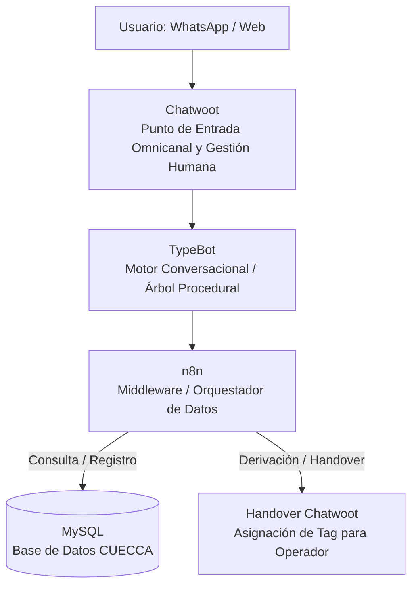

# 🏗️ Arquitectura del Sistema e Integraciones: Bot CC (CUECCA)

Este documento describe la arquitectura conceptual, el modelo de datos y el flujo de integración procedural entre las plataformas que componen el ecosistema **Bot CC** para la Cooperativa CUECCA (Castelli Ltda.).

---

## 🏛️ 1. Esquema Conceptual de Arquitectura

El sistema opera bajo un modelo de arquitectura modular e integrada, donde cada componente cumple un rol específico en el procesamiento de la atención al cliente:

### Componentes y Responsabilidades

* **Chatwoot (Front-end de Gestión):** Funciona como la plataforma central de mensajería. Recibe los mensajes del usuario vía WhatsApp o Web y, si corresponde, gestiona la bandeja de entrada para la atención humana.
* **TypeBot (Motor Procedural):** Ejecuta la interfaz conversacional guiada. Presenta el menú de opciones, valida las entradas del usuario y recolecta los datos (DNI, Domicilio, Motivo de Reclamo).
* **n8n (Middleware e Integración):** Actúa como el cerebro conector. Recibe los datos enviados por TypeBot, efectúa las consultas/inserciones en la base de datos MySQL y determina si el flujo continúa de forma automática o si requiere derivación.
* **MySQL (Base de Datos Central):** Repositorio de lectura/escritura donde se consultan los estados de deuda y se registran los reclamos técnicos ingresados.

---

## 🔀 2. Mapa de Integraciones y Protocolos Procedurales

El intercambio de información entre componentes se organiza en 3 flujos procedurales principales:

| Flujo de Integración | Origen ──> Destino | Propósito y Tipo de Datos | Resultado Procedural |
| :--- | :---: | :--- | :--- |
| **Validación y Consulta** | TypeBot ──> n8n ──> MySQL | Envío de DNI / N° Socio para consultar deuda o estado de cuenta. | Retorna desglose de períodos impagos o confirmación de saldo $0. |
| **Registro de Incidente** | TypeBot ──> n8n ──> MySQL | Envío de datos del reclamo (Servicio, Motivo, Domicilio, Teléfono). | Genera número de ticket en la tabla de reclamos y confirma al usuario. |
| **Derivación a Humano** | TypeBot / n8n ──> Chatwoot | Activación de transferencia de control cuando se requiere atención presencial, trámites especiales o fallos de validación. | Detiene el bot y asigna el Tag contextual (`Caja_Atencion`, `Tramites_Atencion`, `Reclamo_Tecnico_Prioridad`). |

---

## 🗄️ 3. Modelo Conceptual de Datos (MySQL)

Para soportar las consultas procedurales del bot y el registro de reclamos, la base de datos se estructura en las siguientes entidades conceptuales:

### 3.1. Entidad `Socios` / `Usuarios`
* **Propósito:** Identificación unívoca del cliente de CUECCA.
* **Campos Clave:** `ID_Socio`, `Nombre_Titular`, `DNI_CUIT`, `Domicilio_Servicio`, `Tipo_Tarifa` (T1SEF, T1GB, T1R).

### 3.2. Entidad `Cuenta_Corriente` / `Facturacion`
* **Propósito:** Consulta informativa de deudas y saldos.
* **Campos Clave:** `ID_Factura`, `ID_Socio`, `Servicio` (Energía, Agua, Cloacas, Internet), `Periodo`, `Monto_Adeudado`, `Fecha_Vencimiento`, `Estado_Pago`.

### 3.3. Entidad `Reclamos_Temporales`
* **Propósito:** Almacenamiento de tickets generados por el bot.
* **Campos Clave:** `ID_Ticket`, `ID_Socio`, `Servicio_Afectado`, `Motivo_Reclamo`, `Domicilio_Incidente`, `Telefono_Contacto`, `Estado_Ticket` (Pendiente / En Proceso), `Fecha_Registro`.

---

## 🛡️ 4. Reglas de Trazabilidad y Aislamiento

1. **Aislamiento de Operaciones:** El bot tiene acceso de **solo lectura** sobre las tablas de facturación y cuenta corriente. No realiza modificaciones sobre saldos ni estados de deuda.
2. **Registro Único de Reclamos:** Toda interacción que genere un ticket técnico escribe únicamente en la tabla de reclamos, asegurando que la guardia técnica de CUECCA tenga una fuente única de información.
3. **Persistencia de Sesión:** Durante la interacción con TypeBot, los datos de validación (DNI y Domicilio) se mantienen en variables de sesión temporales y se eliminan al finalizar o derivar la conversación.
